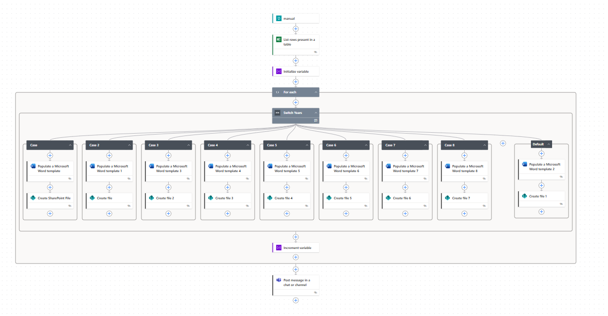
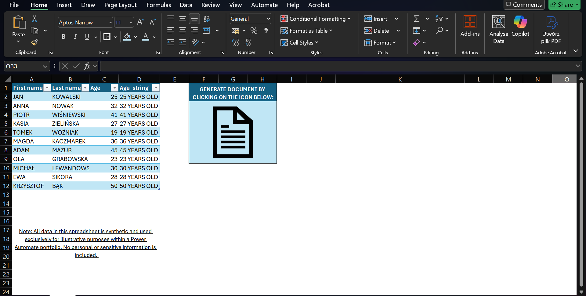
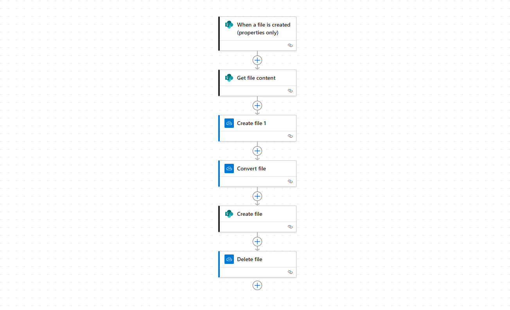

# Project 1: Automated Document Generation from Excel

**Description:**  
This Power Automate flow automatically generates Word and PDF documents based on data from an Excel file. The process is triggered manually after clicking the link, and the resulting documents are saved to SharePoint.

**Limitations and Problem-Solving Approach:**

Due to limited access to certain systems and data within the current organizational structure, I often need to find alternative ways to solve problems. This frequently involves designing additional workflows or creating workarounds to achieve the desired outcomes.

These constraints have strengthened my ability to think creatively, adapt quickly, and make the most of the tools and resources available to me.

In this case, limited access required me to split a single process into two separate Power Automate flows:

1. **Flow 1** – Generates Word documents and saves them to a SharePoint location.
2. **Flow 2** – Monitors the SharePoint folder and converts the newly created Word files into PDF format.

This workaround ensures the process runs smoothly despite the technical constraints.

**Technologies Used:**  
- Power Automate  
- Microsoft Excel Online  
- Microsoft Word (template-based)  
- SharePoint  

**Workflow 1 Overview: Word document Generation from Excel**  

1. The user fills in the data in a previously prepared Excel template.
2. The user triggers the flow manually by clicking a link in an Excel file, which opens an HTML page.

4. The flow reads data from an Excel file stored in SharePoint.
5. Based on the data in the Excel file (column D), the flow identifies which type of document needs to be generated and selects the appropriate Word template.
6. A Word document is generated using the selected template and filled with the relevant data.
7. The document is saved with a filename that includes the person's first and last name.
8. The flow keeps track of how many documents have been generated during the run.
9. Once the process is complete, a summary message is sent to the entire team via Microsoft Teams, including the number of documents created.

**Workflow 2 Overview: Automated PDF Conversion Flow with OneDrive Workaround**

1. The flow is triggered automatically when a new file is added to a specific SharePoint folder.
2. A copy of the file is created in OneDrive, preserving the original file name and structure.
3. The file in OneDrive is then converted to PDF format.
4. The resulting PDF is saved back to the designated SharePoint folder.
5. Finally, the temporary file stored in OneDrive is deleted to keep the workspace clean.

This approach was necessary due to permission limitations that prevented direct conversion on SharePoint. By leveraging OneDrive as an intermediate step, the process remains fully automated and reliable.

**Use Cases:**  
- Generating contracts, certificates, or reports  
- Automating HR, payroll, or administrative processes  
- Reducing manual document creation time
  
**Repository Contents:**  
- `flow-overview.png` – visual diagram of the 1 workflow
- `flow-overview1.png` – visual diagram of the 2 workflow
- `template.docx` – sample Word template  
- `data.xlsx` – sample Excel data file  
- `instructions.md` – step-by-step setup guide

**Author:**  
Bartosz Pawlowski

---

## Additional Notes

This project is part of a broader initiative to combine data analytics and automation using Microsoft Power Platform. Feel free to explore, reuse, or adapt the flow for your own business needs.
